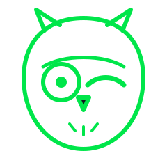

# METATRON × CONDUIT — brand mark brainstorm 🦉➡️❓

We're replacing the **winking-face logomark**. The animation (a face that winks at the end of the reel) is a keeper — **only the glyph changes.** The current owl reads too "wingding clip-art" and we want something sharper.

## The current mark (being replaced)

→ [`current/owl_mark_CURRENT.svg`](current/owl_mark_CURRENT.svg) · it also winks at the end of the reel ([`current/outro_card.svg`](current/outro_card.svg)).

## What we want

A simple, modern, premium mark of **a face (or object) that winks** — works at favicon size, one or two colors, no gradients-required, reads instantly. It's the icon for a private AI-orchestration app: you talk to one operator (METATRON) and a whole fleet of AI "employees" gets the work done.

## Directions already on the table

| # | Direction | Idea |
|---|-----------|------|
| 1 | **Semicolon wink `;)`** | A winking terminal cursor — pure, no clip-art. Ties to "just talk to it." |
| 2 | **Refined owl** | Keep the owl (wise, night-ops) but drawn like a real logo — bold, geometric. |
| 3 | **Winking agent/bot** | A minimal robot face that winks — literally "the AI employee." |
| 4 | **Metatron conductor** | A winking conductor + baton — the one who runs the fleet. |

## How to pitch an idea

- **Fastest:** [open an Issue](../../issues/new) with an emoji, a description, or a sketch/image.
- **Vector:** drop an `.svg` into `candidates/` and open a PR (name it `candidates/<yourname>_<idea>.svg`).
- Anything goes — rough is fine. We just want directions to react to.

_Palette hint (not required): the app's accent green is `#00E64A` on near-black `#0F191C`, but a mark that works in one flat color is ideal._
